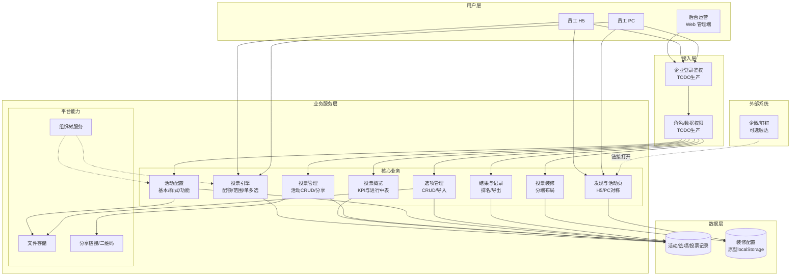
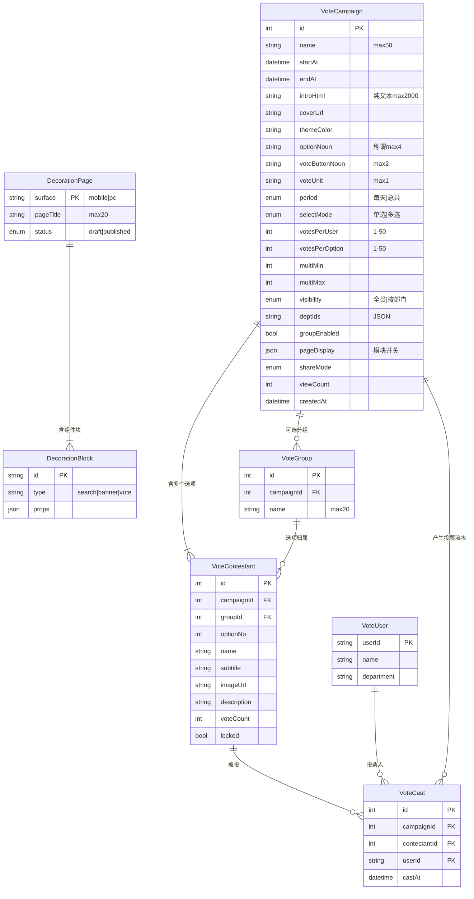
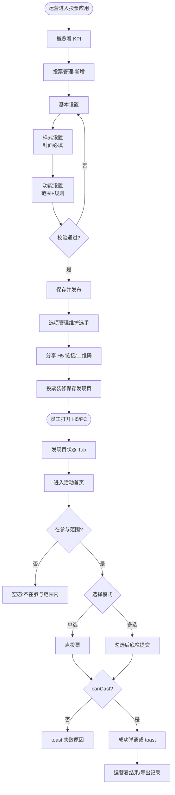
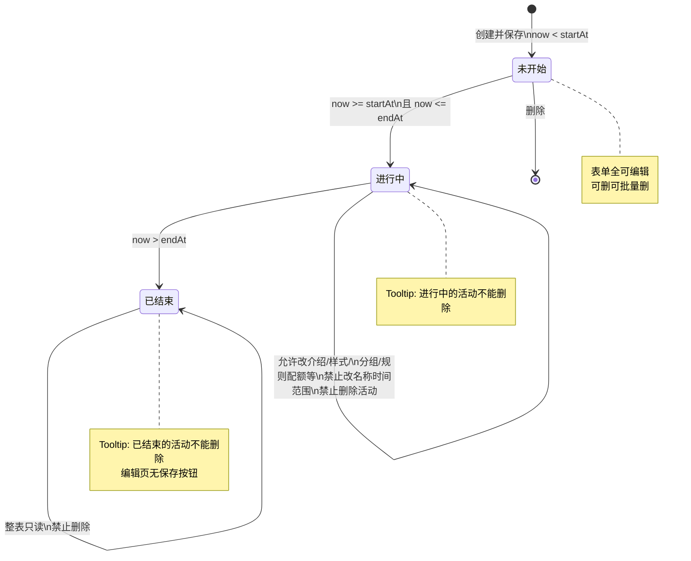

# 投票应用（管理后台 / PC / H5）PRD

| PRD 审核人 | [TODO: 待指定] |
| --- | --- |
| 重要性 | 高 |
| 紧迫性 | 中 |
| 需求方 | [TODO: 待确认，原型侧偏运营/HR] |
| PRD 编写人 | [TODO: 待填写] |
| PRD 提交日期 | 2026-09-02 |

## PRD 修改记录

| 变更时间 | 变更内容 | 变更提出部门与理由 | 修改人 | 审核人 | 版本号 |
| --- | --- | --- | --- | --- | --- |
| 2026-09-02 | 初始版本：基于 voting-v2 原型反向整理总 PRD | — | create-prd | [TODO] | v1.0 |

> **文档说明**
> - 产品定型：**企业自研系统 × 工具型软件**
> - 范围：管理后台 + PC C 端 + H5 C 端；一份总 PRD
> - 依据：`src/features/voting-v2` 现行原型（旧应用 `voting` 废弃，不在范围）
> - 原型限制：活动数据内存 store；装修 persist localStorage；无真实 HTTP/RBAC。落生产时接口与权限见第 12、14 章 `[TODO]`

---

## 1、项目背景

> 💡 方法论提示：《决胜 B 端》三层业务调研（战略→战术→执行）

### 1.1 业务现状

企业内部评选、人气赛、作品点赞等多场景，需在可控范围内完成「配置活动 → 员工参与 → 看结果导出」。康尼应用套件已有活动、兴趣圈等模块；投票应用作为独立工具型应用，提供后台配置、装修发现页、H5/PC 对称参与能力。

原型侧已实现完整主路径（概览、投票管理、选项、装修、C 端投票与记录），数据为演示种子，刷新会丢投票流水（装修配置可 persist）。

[TODO: 请补充组织侧现状数据：年评选场次、当前临时方案（企微投票/表格/第三方）、运营人数]

### 1.2 面临问题

1. **工具碎片化**：临时用外部投票/表格，规则（配额、部门范围、单多选）难统一，结果难沉淀。
2. **配置与 C 端脱节**：封面、主题、分组、页面模块与发现页装修若分离，员工端体验不一致。
3. **结果可运营性不足**：缺排名占比、记录导出、分享二维码时，运营复盘成本高。
4. **状态管控缺失**：进行中误删、已结束仍可改关键规则，易引发票数争议。

### 1.3 解决思路

打造「配置驱动活动页 + 装修驱动发现页」的企业内投票工具：

- 后台：概览监控 → 活动 CRUD（基本/样式/功能）→ 选项管理 → 结果/记录 → 分端装修
- C 端：H5/PC 对称，状态 Tab 浏览 → 活动首页投票 → 选项详情 → 我的记录
- 用活动状态机锁字段（未开始全开 / 进行中锁名称·时间·范围 / 已结束只读）降低运营风险

### 1.4 决策依据

- 原型已闭环主路径，可作为评审与研发对照基线
- 与活动应用共享组织树（部门可见范围），利于统一账号与组织数据
- [TODO: 请补充立项决策：管理层诉求、试点部门、期望上线窗口]

---

## 2、需求基本情况

> 💡 方法论提示：需求发现十三要素 — 角色 + 场景六要素

| 要素 | 内容 |
| --- | --- |
| **需求提出人** | [TODO: 待确认，假设为 HR/企业文化或运营负责人] |
| **功能使用人** | 后台运营（原型演示「陈产品」）；员工投票人（原型 DEMO「张悦 / 前端组」） |
| **受影响人** | 被评选对象/作品方；部门负责人（按部门可见时）；IT/安全（分享外链、富文本 XSS） |
| **场景描述** | 见下方 |
| **发生频率** | [TODO: 假设月均 若干场企业内部评选；日常多为「进行中活动投票」] |
| **核心痛点** | 运营无法在一套工具内完成配置、传播、控范围、看结果 |
| **需求价值** | 缩短活动上线耗时；票数可审计导出；C 端体验与后台预览一致 |

### 核心场景描述

**场景1：运营发布人气评选**
- **人物**：后台运营
- **时间**：活动开始前 1～3 天
- **地点**：管理后台「投票」应用
- **起因**：需要组织一次部门内作品投票
- **经过**：概览看规模 → 投票管理新增 → 填名称/时间/介绍 → 上传封面与主题 → 配规则与参与范围 → 保存并发布 → 选项管理加选手/导入 → 列表分享 H5 链接/二维码 → 装修发现页并保存
- **结果**：员工可在 H5/PC 发现并投票；运营在详情看结果与导出记录

**场景2：员工参与投票（单选）**
- **人物**：员工投票人
- **时间**：活动进行中
- **地点**：H5 或 PC
- **起因**：收到分享链接或从发现页进入
- **经过**：状态 Tab「进行中」→ 卡片「查看详情」→ 点选项投票 → 成功弹窗展示今日剩余票
- **结果**：票数更新；达配额后再次投票提示上限

**场景3：员工多选提交**
- **人物**：员工
- **经过**：首页「选择」勾选 → 底栏显示已选与 min～max 提示 → 达 min 后点「投票」一次写入多条
- **结果**：toast「投票成功」（无弹窗）；超 max 不可再选

**场景4：运营复盘**
- **人物**：运营
- **经过**：活动详情 → 投票结果（排名/占比）→ 投票记录 → 导出 CSV
- **结果**：可线下存档或二次分析

---

## 3、业务分析与系统调研

> 💡 企业自研适配：同类调研 + 痛点优先级（不做市场规模）

### 3.1 同类系统调研

| 调研对象 | 类型 | 核心能力 | 可借鉴点 | 局限性 |
| --- | --- | --- | --- | --- |
| 康尼「投票」旧版（`voting`） | 内部废弃 | 早期投票能力 | 迁移时避免双入口混淆 | 与 v2 并存易培训混乱 |
| 康尼「活动应用」 | 内部 | 组织树、报名、装修 | 部门树、装修工作台模式 | 活动≠投票规则（配额/单多选） |
| 企微/钉钉原生投票 | 外部 | 轻量群内投票 | 触达快 | 弱装修、弱选项素材、弱企业后台复盘 |
| 第三方评选 SaaS | 外部 | 选手页、防刷、排行 | 选手卡片/排行体验 | 数据外流、权限与组织难对齐 |

### 3.2 业务痛点优先级

| 排序 | 痛点描述 | 影响范围 | 严重程度 | 紧迫度 | 涉及部门 |
| --- | --- | --- | --- | --- | --- |
| 1 | 无统一配置+参与+结果闭环 | 全公司评选场景 | 高 | 高 | 运营/HR |
| 2 | 参与范围与配额难控 | 跨部门公平性 | 高 | 高 | HR/部门负责人 |
| 3 | 发现页与活动页视觉不可配 | 员工端转化 | 中 | 中 | 运营/设计 |
| 4 | 结果导出与审计不足 | 复盘与争议 | 中 | 中 | 运营/审计 |

### 3.3 投入产出初步评估

| 维度 | 估算 |
| --- | --- |
| **预计投入** | [TODO: 研发人天/上线窗口；原型已覆盖大部分 UI，重点在后端、鉴权、防刷、装修发布语义对齐] |
| **效率提升** | 单场活动配置从「多工具拼接」收敛为后台一站式；记录导出替代手工汇总 |
| **业务价值** | 评选可沉淀到企业内；与组织权限一致，降低外链合规风险 |

---

## 4、项目收益目标

> 💡 SMART：效率与采纳优先（企业自研 × 工具型）

### 4.1 项目目标

| 目标类型 | 目标描述 | 衡量指标 | 目标值 | 达成时限 |
| --- | --- | --- | --- | --- |
| **效率目标** | 缩短单场投票从配置到可分享耗时 | 运营完成「发布+选项+分享」中位时长 | [TODO: 建议 ≤30 分钟] | 上线后 1 个月 |
| **采纳目标** | 评选场景切到本应用 | 月活跃投票活动数 / 试点部门覆盖率 | [TODO] | 上线后 3 个月 |
| **体验目标** | C 端投票主路径一次成功 | 投票成功率（成功/(成功+失败)） | [TODO: 建议 ≥95%] | 上线后 1 个月 |
| **数据目标** | 结果可导出可复盘 | 有记录活动的导出使用率 | [TODO] | 上线后 2 个月 |

### 4.2 验收标准

1. 后台可完成：概览 KPI、活动 CRUD、状态锁字段、选项 CRUD/导入、结果/记录/导出、分享、分端装修保存。
2. H5/PC：装修驱动发现列表、活动首页单选/多选、选项详情、范围外空态、我的记录。
3. 活动状态：未开始可删；进行中/已结束不可删；已结束编辑只读。
4. 关键校验与 toast/弹窗文案与原型一致（见第 10.3）。
5. [TODO: 生产环境需：登录鉴权、接口幂等、浏览量真实上报、装修 draft/publish 语义对齐]

### 4.3 成功标准

> 项目上线后 3 个月内，达到以下视为成功（数值待业务拍板）：

1. 试点部门 ≥[TODO]% 内部评选走本应用
2. 运营满意度或 NPS ≥[TODO]
3. 因规则争议导致的客诉环比下降 [TODO]

---

## 5、项目方案概述

### 5.1 核心功能概述

| 序号 | 功能模块 | 功能简述 | 优先级 | 端 |
| --- | --- | --- | --- | --- |
| 1 | 投票概览 | 日期范围过滤；KPI（总数/进行中/参与人数/浏览量）；进行中表下钻 | P0 | 后台 |
| 2 | 投票管理 | 查询分页、新增编辑详情、分享、批量删除（仅未开始） | P0 | 后台 |
| 3 | 活动配置表单 | 基本/样式/功能三 Tab；保存并发布；手机预览 | P0 | 后台 |
| 4 | 选项管理 | CRUD、抽屉、复制、批量导入图片/CSV、锁定 | P0 | 后台 |
| 5 | 结果与记录 | 排名占比；记录列表；CSV 导出 | P0 | 后台 |
| 6 | 投票装修 | 搜索/轮播/投票块；移动端与 PC 分端；保存生效 C 端列表 | P0 | 后台 |
| 7 | 发现投票 | 装修驱动；状态 Tab；卡片进首页；我的记录入口 | P0 | H5/PC |
| 8 | 活动首页投票 | 单选即时投+成功弹窗；多选底栏提交；倒计时；范围校验 | P0 | H5/PC |
| 9 | 选项详情 | 排名差票；H5 底栏 / PC 侧栏 CTA | P0 | H5/PC |
| 10 | 我的投票记录 | 按状态看个人参与过的活动 | P1 | H5/PC |
| 11 | 分享能力 | 后台二维码+链接；C 端复制（禁止分享时隐藏） | P1 | 后台/C端 |

### 5.2 方案概述

- **产品方案**：配置驱动活动页（`VoteV2PhonePreview` 共用）+ 装修驱动发现页；H5/PC 规则同源、布局分端。
- **技术方案**：前端原型 React/TS；生产需活动服务、投票幂等、组织权限、装修发布；富文本需消毒。
- **运营方案**：试点部门 → 模板化活动（封面/称谓）→ 培训后台三菜单（概览/管理/装修）。

### 5.3 MVP 范围

**MVP 包含：** 上表 P0 全部 + 删除状态策略 + 部门可见范围 + 基础分享。

**MVP 暂不包含 / 原型未闭环：**
- 真实报名审核、邀请码、防刷、微信 SDK 分享（模型有字段，表单/C 端未做完）
- 封面视频/链接（模型有，表单仅图片）
- 浮动特效（保存写死「无」）
- 旧版投票迁移工具

**核心验证假设：**
1. 运营可用后台独立完成一场评选上线
2. 员工在配额与范围内可顺利投完
3. 结果 Tab + CSV 满足复盘

---

## 6、项目范围

### 6.1 范围内

| 端 | 页面/能力 |
| --- | --- |
| 后台 | `#/voting-v2/vote-v2-overview` 概览 |
| 后台 | `#/voting-v2/vote-v2-list` 投票管理 |
| 后台 | `#/voting-v2/vote-v2-create` / `vote-v2-edit/:id` / `vote-v2-detail/:id`（含 results/records） |
| 后台 | `#/voting-v2/vote-v2-players/:id` 选项管理 |
| 后台 | `#/voting-v2/vote-v2-layout`（及 mobile/pc）投票装修 |
| H5/PC | `#/c/{h5\|pc}/votes-v2` 发现；`/mine` 记录；`/vote-v2-:id` 首页；`/option-:optionId` 详情 |

### 6.2 范围外

- 旧应用「投票-废弃」(`voting`)
- 支付/打赏、外部分享裂变增长（非企业自研重点）
- 完整 IAM 权限码设计（原型无；第 12 章给建议方案）
- 小程序原生端（可用 H5）

### 6.3 依赖

| 依赖 | 说明 |
| --- | --- |
| 组织架构树 | 与活动模块 `orgDepartmentTree` / `personDepartment` 同源 |
| 企业登录身份 | C 端 userId、部门；后台操作者身份 [TODO] |
| 对象存储 | 封面、选手图、导入图 [TODO] |
| 消息/企微 | 非必须；分享以链接+二维码为主 |

---

## 7、项目风险

| 风险 | 影响 | 可能性 | 应对 |
| --- | --- | --- | --- |
| 装修「保存」=publish 但 C 端读 draft | 误发/未发错觉 | 高（原型已存在） | 上线前对齐：C 端读 published 或独立发布按钮（P0） |
| 选项详情多选活动仍 `castVoteV2` 单票 | 绕过 min/max | 高 | 详情与首页规则统一（P0） |
| 进行中可改配额/删选项 | 票数争议 | 高 | 锁选项删除或强提示重算策略（P0） |
| 无后端刷新丢票 | 演示可、生产不可 | 确定 | 持久化 + 投票幂等 |
| 富文本 XSS | 安全事件 | 中 | 服务端/前端消毒 |
| 浏览量仅种子不自增 | KPI 失真 | 中 | 打开首页 +1 或下线指标 |
| 双应用并存 | 培训混乱 | 中 | 下线旧入口 |
| 分享链接写死 H5 | PC 用户体验差 | 中 | 按端生成链接 |

---

## 8、术语表

| 术语 | 定义 |
| --- | --- |
| 活动 / Campaign | 一次投票活动实体 |
| 选项 / Contestant / 选手 | 可被投票的对象 |
| 票单位 voteUnit | 展示用单位，如「票」「赞」 |
| 投票按钮名词 voteButtonNoun | CTA 文案，如「投票」「点赞」 |
| 周期 period | 「每天」或「总共」配额窗口 |
| 配额 votesPerUser | 每人在周期内可投票次数（1～50） |
| 同一选项票 votesPerOption | 同一选项可被同一人投的次数上限 |
| 选择模式 | 单选 / 多选（多选含 min～max） |
| 可见性 | 全员 / 按部门 |
| 装修 Decoration | 发现页布局：search / banner / vote 块 |
| 状态 | 由 startAt/endAt 与当前时间推导：未开始/进行中/已结束 |

---

## 9、参考文献

| 类型 | 引用 |
| --- | --- |
| 原型代码 | `src/features/voting-v2/**` |
| 既有截图 PRD | `docs/prd/voting-v2/投票-PRD.html` |
| 截图目录 | `docs/prd/voting-v2/screenshots/` |
| 组织树依赖 | `src/features/activities/model/activity`（orgDepartmentTree） |
| [TODO] | 业务方立项材料、安全规范、埋点平台文档 |

---

## 10、功能需求

> 💡 方法论提示：自顶向下（框架→数据→流程→页面→规则）；工具型侧重核心使用流程效率

### 10.1 产品框架概述

#### 10.1.1 应用架构图

#### 10.1.2 数据模型图

**实体说明**

| 实体 | 说明 | 关键业务规则 |
| --- | --- | --- |
| VoteCampaign | 投票活动 | 状态由时间推导；进行中锁 name/startAt/endAt/visibility |
| VoteContestant | 选项/选手 | locked 时不可投；编号可重复（风险见第14章） |
| VoteCast | 投票流水 | 受 period×votesPerUser×votesPerOption 约束 |
| VoteGroup | 分组 | groupEnabled 时 C 端可出分组 Tab |
| DecorationPage | 发现页装修 | 原型 C 端读 draft；生产应对齐 published |

#### 10.1.3 核心使用流程图

#### 10.1.4 活动状态机

**状态转换表**

| 当前状态 | 触发 | 下一状态 | 约束 |
| --- | --- | --- | --- |
| — | 保存并发布且 start>now | 未开始 | 名称≤50；时间必填且 start<end；封面必填 |
| 未开始 | 时钟到达 startAt | 进行中 | 自动，无人工操作 |
| 进行中 | 时钟超过 endAt | 已结束 | 自动 |
| 未开始 | 确认删除 | 删除 | 二次确认 |
| 进行中/已结束 | 点删除 | 保持 | 按钮禁用 |

#### 10.1.5 功能清单

| ID | 功能 | 端 | 优先级 | 原型状态 |
| --- | --- | --- | --- | --- |
| F01 | 概览 KPI + 进行中表 | 后台 | P0 | 已实现 |
| F02 | 活动列表查询/分页 | 后台 | P0 | 已实现 |
| F03 | 新建/编辑/详情表单 | 后台 | P0 | 已实现 |
| F04 | 选项管理 CRUD/导入 | 后台 | P0 | 已实现 |
| F05 | 投票结果/记录/导出 | 后台 | P0 | 已实现 |
| F06 | 投票装修分端 | 后台 | P0 | 已实现 |
| F07 | 发现列表（装修驱动） | H5/PC | P0 | 已实现 |
| F08 | 单选/多选投票 | H5/PC | P0 | 已实现 |
| F09 | 选项详情 | H5/PC | P0 | 已实现 |
| F10 | 我的记录 | H5/PC | P1 | 已实现 |
| F11 | 分享弹窗/复制链接 | 后台/C端 | P1 | 已实现 |
| F12 | 按部门可见 | 后台/C端 | P1 | 已实现 |

---

### 10.2 产品需求详解

#### 10.2.1 后台 · 概览（F01）

**目标：** 按日期范围监控规模与进行中活动，快速下钻。

**页面要素**

| 元素 | 类型 | 规则 |
| --- | --- | --- |
| 日期范围 | OverviewDateRange | 活动投票期与区间重叠 **或** createdAt 落在区间内计入 |
| KPI：投票总数 | 可点卡片 | → 投票管理列表（原型不带筛选） |
| KPI：进行中投票 | 可点卡片 | 范围内 status=进行中 |
| KPI：参与人数 | 可点卡片 | cast 去重 userId |
| KPI：浏览量 | 可点卡片 | viewCount 求和；**原型 C 端打开不自增** |
| 进行中表格 | Table | 列：名称、投票时间、选项数、投票数；操作「详情」 |

**交互：** 无进行中 → Empty「当前没有进行中的投票」。

**截图对照：** `投票概览-页面整体.png`、`投票概览-KPI指标卡.png`、`投票概览-进行中表格.png`

---

#### 10.2.2 后台 · 投票管理列表（F02/F11）

**筛选**

| 字段 | 控件 | 规则 |
| --- | --- | --- |
| 活动名称 | Input | 模糊 |
| 状态 | Select 可清 | 未开始/进行中/已结束（时间推导） |
| 投票时间 | Range | 与活动区间重叠 |

**列表列：** 名称、状态 Tag、投票时间、选项数、投票数、浏览量、操作（详情/编辑/选项管理/分享/删除）

**操作规则**

| 操作 | 前置 | 系统响应 |
| --- | --- | --- |
| 新增 | — | → create |
| 详情 | — | → detail 默认详情 Tab |
| 编辑 | — | → edit；已结束进只读 |
| 选项管理 | — | → players |
| 分享 | — | Modal：H5 链接 + 二维码；复制/下载 PNG |
| 删除 | 仅未开始 | 二次确认；进行中/已结束禁用+Tooltip |
| 批量删除 | 勾选 | 跳过不可删并提示跳过数 |

**截图对照：** `投票管理-页面整体.png`、`投票管理-查询筛选区.png`、`投票管理-分享弹窗.png`、`投票管理-进行中删除禁用Tooltip.png`

---

#### 10.2.3 后台 · 新建/编辑/详情表单（F03）

**布局：** 左手机预览（`VoteV2PhonePreview`）+ 右三 Tab；底栏：取消 / 下一步 / 保存并发布（只读无保存）。

**基本设置**

| 字段 | 必填 | 校验 |
| --- | --- | --- |
| 活动名称 | 是 | ≤50；空→「请输入活动名称」；进行中锁定 |
| 投票时间 | 是 | 必填；start&lt;end；进行中锁定 |
| 活动介绍 | 否 | RichText 纯文本 ≤2000 |

**样式设置**

| 字段 | 必填 | 说明 |
| --- | --- | --- |
| 封面 | 是 | jpg/png；空→「请上传封面图」 |
| 主题色 | 否 | 预设色板（蓝/青/红等） |
| 称谓 / 按钮名 / 单位 | 否 | 长度 4 / 2 / 1 |
| 首页列数 | 否 | 1/2/3 |
| 页面显示开关 | 否 | 控制 C 端模块；关「投票按钮」会导致无 CTA（风险） |

**功能设置**

| 字段 | 规则 |
| --- | --- |
| 分组 | 可选；分组名 ≤20 |
| 参与范围 | 全员 / 按部门（TreeSelect）；按部门未选→「请选择部门」；进行中锁定 |
| 周期 | 每天 / 总共 |
| 选择 | 单选 / 多选；多选最少≤最多 |
| 每人可投票 / 同一选项票 | 整数 1～50；同一选项票 ≤ 每人票 |
| 规则提示 | 文案展示于 C 端 |
| 选项管理入口 | 新建成功进编辑后出现「去选项管理」 |

**底栏**

| 按钮 | 行为 |
| --- | --- |
| 下一步 | 切 Tab，末项停功能设置；**不校验** |
| 保存并发布 | 全量校验；成功新建→编辑页；toast 成功 |
| 取消/离开 | 「确认离开？未保存的修改将丢失」 |

**详情页顶栏：** 去编辑 / 返回；页签：详情 | 投票结果 | 投票记录（hash 同步 `/results` `/records`）。

**投票结果：** 按票数排名、占比；同票并列。

**投票记录：** 姓名、部门、时间、内容；导出 CSV（多选分列）；无数据→「暂无投票可导出」。

**截图对照：** `新建活动-*.png`、`编辑活动-*.png`、`活动详情-*.png`

---

#### 10.2.4 后台 · 选项管理（F04）

**能力：** 关键词/分组筛选、分页；添加/编辑/详情抽屉；复制；删除确认；批量导入（图片文件名作标题 / CSV）；锁定选项。

**CSV 列建议：** 编号、选项标题、副标题、分组名、描述；无标题行可跳过并 warning。

**风险（须产品决策）：** 活动进行中仍可删选项/导入，与活动删除策略不一致 → 见第 14 章待决。

**截图对照：** `选项管理-*.png`

---

#### 10.2.5 后台 · 投票装修（F06）

**工作台：** 移动端 / PC 分端；组件：search、banner、vote。

| 块 | 关键配置 |
| --- | --- |
| search | 有无搜索 |
| banner | 轮播图与链接 |
| vote | 标题默认「发现投票」；样式 large-image / left-image / left-text；latestCount 1～20；PC 可配列数 |

**保存语义（原型）：**
- 拖拽/改块 → `save` 写草稿 localStorage `koni-vote-v2-decoration`
- 主按钮「保存」→ `publish`，toast「已保存，C端首页已更新」
- **C 端列表实际读 draft** → 与按钮文案不一致，上线前必须改（P0）

页面标题 max 20。预览 chrome 含状态 Tab +「我的记录」。

---

#### 10.2.6 C 端 · 发现投票（F07/F10）

**共性（H5/PC）：** 壳标题 = 装修 `pageTitle`（默认「投票」）；状态 Tab：进行中/未开始/已结束；右侧「我的记录」；卡片 CTA 文案为「查看详情」（非「去投票」）；列表按 `canSeeVoteV2` 过滤；`latestCount` 截断。

**差异：** PC 宽屏壳 + 卡片网格列数跟装修；H5 竖屏卡片流。

**我的记录：** 展示当前用户参与过的活动卡片（含封面），点击回活动首页。

**截图对照：** `H5投票列表-*.png`、`PC投票列表-*.png`、`H5我的记录-列表.png`、`PC我的记录-列表.png`

---

#### 10.2.7 C 端 · 活动首页投票（F08）

**展示：** 封面/主题/介绍/倒计时（未开始→startAt，进行中→endAt）/分组 Tab/搜索（若开）/选手卡片（编号、票数、详情）。

**单选：** 按钮文案 = voteButtonNoun；点击 `castVoteV2`；成功 Dialog「投票成功」+「今日还可投 N{unit}」。

**多选：** 按钮「选择」↔「取消」；选中描边；底栏 `已选n{unit}` + `请选择min-max{unit}进行{noun}`；未达 min 不可确认；一次 `castVoteV2Many`；成功 toast「投票成功」。

**失败 toast（节选）：** 活动未在投票期 / 该选项已锁定 / 不在参与范围内 / 已达投票上限 / 该选项已达可投次数。

**范围外 / 活动不存在：** 壳标题「评选活动」；文案「不在参与范围内」或「活动不存在」。

**截图对照：** `H5投票首页-*.png`、`PC投票首页-进行中.png`、`H5投票成功弹窗.png`

---

#### 10.2.8 C 端 · 选项详情（F09）

展示编号、名称、副标题、排名、当前票、距上一名差票、图、描述 HTML。

- H5：底栏固定 CTA
- PC：右侧栏 CTA
- locked：按钮 disabled
- **缺陷：** 详情始终 `castVoteV2` 单票，多选活动可绕过首页 min/max → P0 必改

---

### 10.3 异常情况处理方案

| 场景 | 系统行为 |
| --- | --- |
| 空名称/无时间/无封面保存 | 对应校验文案；建议自动切到报错 Tab（原型未做，P0 改进） |
| 介绍超 2000 字 | 「不超过 2000 个字」 |
| 按部门未选部门 | message.error「请选择部门」 |
| 配额非法 / 最少>最多 | 对应 error |
| 未保存离开 | 确认对话框 |
| 删进行中/已结束 | 禁用 + Tooltip |
| 投票超额/非投票期/锁定/范围外 | toast |
| 多选未达 min | 底栏不可提交 |
| 多选超 max 再选 | 选择不增加（blocked） |
| CSV/图片导入失败 | warning/error 行级提示 |
| 复制无剪贴板权限 | 「复制失败，请手动复制链接」 |
| 记录为空导出 | 「暂无投票可导出」 |
| 刷新浏览器（原型） | 活动/投票回种子；装修若 persist 保留 |
| 装修 latestCount=1 | 每 Tab 最多 1 卡 |

---

## 11、数据埋点

> 原型无埋点；以下为建议方案，供研发与数据对齐。

### 11.1 页面浏览

| 事件 | 触发 | 属性 |
| --- | --- | --- |
| vote_admin_overview_view | 打开概览 | dateRange |
| vote_admin_list_view | 打开投票管理 | filters |
| vote_c_list_view | 打开发现页 | surface=h5\|pc |
| vote_c_home_view | 打开活动首页 | campaignId, status, surface |
| vote_c_option_view | 打开选项详情 | campaignId, optionId, surface |

### 11.2 关键行为

| 事件 | 触发 | 属性 | 目的 |
| --- | --- | --- | --- |
| vote_cast_success | 投票成功 | campaignId, mode, count, remaining | 参与率 |
| vote_cast_fail | 失败 toast | campaignId, reason | 配额/范围诊断 |
| vote_share_copy | 复制链接 | surface=admin\|h5\|pc, campaignId | 传播 |
| vote_share_qr_download | 下载二维码 | campaignId | 线下传播 |
| vote_admin_export | 导出记录 | campaignId, rowCount | 审计 |
| vote_deco_publish | 装修保存/发布 | surface | 配置上线 |
| vote_admin_save_campaign | 保存并发布 | campaignId, isCreate | 配置漏斗 |

### 11.3 核心指标口径

| 指标 | 口径 |
| --- | --- |
| 参与人数 | 活动维度 cast 去重 userId（与概览 KPI 一致） |
| 投票成功率 | success / (success+fail) |
| 发现→首页 CTR | home_view / list 卡片曝光 [TODO: 需曝光事件] |
| 配置完成率 | 有 ≥1 选项且已分享或有票的活动 / 已创建活动 |

---

## 12、角色和权限

> 💡 工具型简化角色；原型无独立权限码，下表为**建议生产方案**。

### 12.1 角色

| 角色 | 说明 | 原型对照 |
| --- | --- | --- |
| 投票管理员 | 后台全部能力 | 「陈产品」 |
| 投票运营（可选） | 管活动/选项/结果，不可改装修 [TODO] | — |
| 员工投票人 | C 端浏览与投票 | 「张悦」 |
| 系统只读审计（可选） | 仅看结果/记录/导出 | — |

### 12.2 功能权限矩阵

| 能力 | 管理员 | 运营 | 员工 | 审计 |
| --- | --- | --- | --- | --- |
| 概览 | ✓ | ✓ | — | ✓ |
| 活动 CRUD | ✓ | ✓ | — | 只读 |
| 删除未开始 | ✓ | ✓ | — | — |
| 选项管理 | ✓ | ✓ | — | 只读 |
| 导出记录 | ✓ | ✓ | — | ✓ |
| 投票装修 | ✓ | [TODO] | — | — |
| C 端投票 | — | — | ✓（范围内） | — |
| 我的记录 | — | — | ✓ | — |

### 12.3 数据权限

| 规则 | 说明 |
| --- | --- |
| 后台数据范围 | [TODO: 全公司 vs 本部门活动] |
| C 端可见 | visibility=全员；或按部门且 user 部门 ∈ 所选部门树 |
| 记录隐私 | 导出含姓名部门；需合规告知 [TODO] |

### 12.4 状态字段锁（业务权限，非 IAM）

同第 10.1.4：进行中锁名称/时间/范围；已结束整表只读；进行中/已结束不可删活动。

---

## 13、运营计划

> 企业自研适配：内部推广 + 培训 + 试点

### 13.1 上线节奏建议

| 阶段 | 动作 | 成功信号 |
| --- | --- | --- |
| 试点 | 1～2 个部门各跑 1 场真实评选 | 完整配置→投票→导出无阻断 |
| 修复 P0 | 装修发布语义、详情多选、校验切 Tab、进行中选项策略 | 验收清单全过 |
| 推广 | 培训后台三菜单；下线旧「投票-废弃」入口 | 工单/答疑量可控 |
| 常态 | 沉淀封面/称谓模板；月度看采纳与成功率 | 指标达第 4 章目标 |

### 13.2 培训要点

1. 先保存活动再管选项；封面在样式 Tab
2. 进行中不能改名称/时间/范围，不能删活动
3. 装修改完必须点「保存」；（修复后）明确 draft/publish
4. 分享默认 H5；PC 用户如何打开 [TODO 产品文案]
5. 按部门活动：确认组织树部门名与员工部门一致

### 13.3 采纳跟踪

| 指标 | 频率 | Owner |
| --- | --- | --- |
| 新建活动数 / 有票活动数 | 周 | 运营 |
| 投票成功率 / 失败 reason Top | 周 | 产品+研发 |
| 导出使用次数 | 月 | 运营 |
| 试点部门 NPS | 试点结束 | 产品 |

---

## 14、待决事项

| ID | 事项 | 建议默认 | 影响 | 优先级 |
| --- | --- | --- | --- | --- |
| T1 | C 端发现页读 draft 还是 published？按钮「保存」是否拆发布？ | C 端读 published；拖拽=草稿；「发布」上线 | 错发/未发 | 必须 |
| T2 | 多选活动选项详情能否直接单票？ | 否；回首页勾选或禁用详情 CTA | 错票 | 必须 |
| T3 | 进行中能否删/导入覆盖选项？ | 禁止删除已产生票的选项；或二次确认+审计 | 争议 | 必须 |
| T4 | 进行中改配额/单多选后历史票如何处理？ | 保存时强提示；已超额用户不可再投；不重算历史 | 客诉 | 必须 |
| T5 | 校验失败是否自动跳转报错 Tab？ | 是 + scrollToFirstError | 发布失败 | 必须 |
| T6 | 分享链接是否按端生成？ | 后台可选 H5/PC；C 端跟当前 surface | 打开端 | 建议 |
| T7 | 关闭「投票按钮」页面设置时如何兜底？ | 禁止关闭或强制保留入口 | 无法投 | 建议 |
| T8 | 报名/防刷/邀请码：做完还是删模型字段？ | MVP 删未实现字段或标「未启用」 | 认知 | 建议 |
| T9 | 浏览量是否真实 +1？ | 打开首页 +1 | KPI | 建议 |
| T10 | 概览 KPI 点击是否带状态筛选？ | 是 | 运营效率 | 建议 |
| T11 | 后台 RBAC 角色是否拆运营/装修？ | 先管理员+员工两级 | 权限 | 可后补 |
| T12 | 单选弹窗 vs 多选 toast 是否统一？ | 统一弹窗展示剩余票 | 体验 | 可后补 |
| T13 | 需求方、成功指标数值、上线窗口 | 业务会拍板 | 立项 | 必须 |
| T14 | 富文本消毒与导出合规 | 必须消毒；导出脱敏策略会审 | 安全 | 必须 |

---

## 附：待完善清单

### 自检快扫（R1–R8）

| 风险项 | 状态 |
| --- | --- |
| R1 产品定位 | ✅ 企业内部评选投票工具 |
| R2 核心业务流程 | ✅ 配置→选项→装修→投票→结果 |
| R3 ER 模型 | ✅ 工具型已给核心 ER（非业务型强制完整） |
| R4 角色权限 | ⚠️ 原型无 IAM；第12章为建议，待确认 |
| R5 功能致命缺口 | ⚠️ 标注了装修语义/详情多选等 P0 缺陷 |
| R6 需求与业务 | ⚠️ 缺真实业务量与提出人，已 TODO |
| R7 合规 | ⚠️ 富文本 XSS、导出隐私待确认 |
| R8 SaaS 多租户 | 不适用（企业自研） |

### 14 维度完成度（摘要）

| 维度 | 评估 |
| --- | --- |
| 01 业务分析 | ⚠️ 框架有，缺量化现状 |
| 02 产品类型适配 | ✅ 企业自研×工具型 |
| 03 定位与目标 | ⚠️ 目标值多 TODO |
| 04 场景旅程 | ✅ 四场景 |
| 05 文档结构 | ✅ 1–14 章齐全 |
| 06 架构 | ✅ Mermaid 五层 |
| 07 数据建模 | ✅ ER + 说明表 |
| 08 流程角色 | ✅ 流程+状态机；权限建议态 |
| 09 交互 | ✅ 分模块对齐原型 |
| 10 商业分析 | ✅ 已换同类调研 |
| 11 MVP | ✅ 含/不含清晰 |
| 12 异常 | ✅ 10.3 表 |
| 13 AI | 不适用 |
| 14 运营与埋点 | ✅ 建议级 |

### 🔴 必须补充（影响可评审性）

1. **拍板 T1–T5、T14**（装修发布、详情多选、进行中选项、配额变更、校验跳转、安全消毒）— 不拍则研发会按错误原型行为实现。
2. **需求提出人 / 试点部门 / 上线窗口** — 第2、4、13章。
3. **成功指标数值** — 第4章目标值。
4. **生产鉴权与数据范围** — 第12章后台是否全公司可见。

### 🟡 建议补充

1. 年评选场次、当前替代工具成本（强化第1章决策依据）。
2. 分享是否接企微 SDK（第6、14章）。
3. 曝光类埋点是否要做（第11章 CTR）。
4. 旧版 `voting` 下线计划与数据迁移。

### 🟢 可选完善

1. 活动模板（封面/称谓预设包）。
2. 结果页可视化图表（超出当前表格式结果）。
3. 管理端移动审批（非原型范围）。

---

> 💡 建议：优先关闭 🔴 项后，可用 `pm-review-board` 或 `/check-prd` 做完整评审。  
> **交付文件：** `docs/prd/voting-v2/投票应用-PRD.md`  
> **原型对照：** `docs/prd/voting-v2/投票-PRD.html` + `screenshots/`
